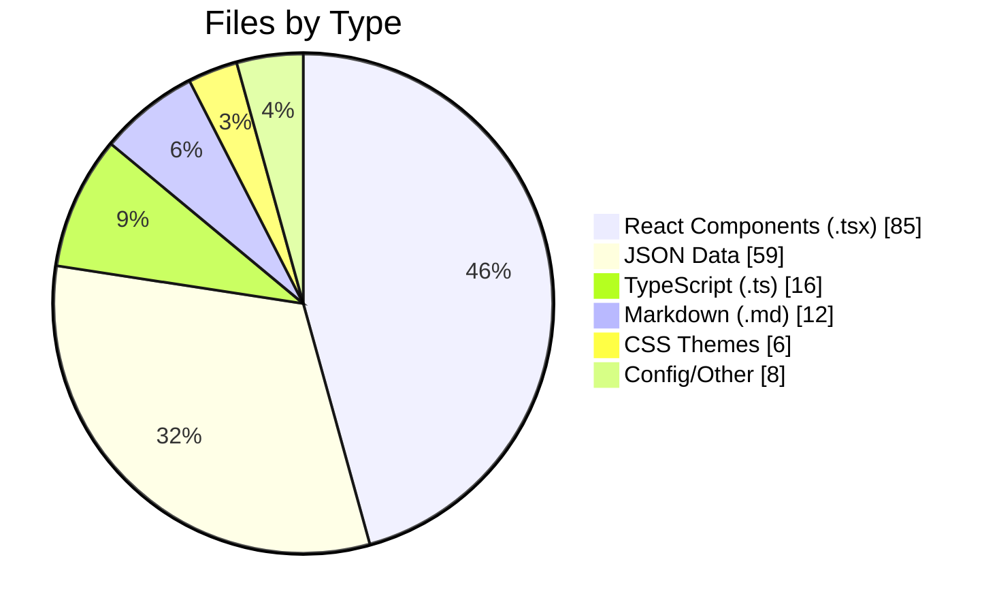
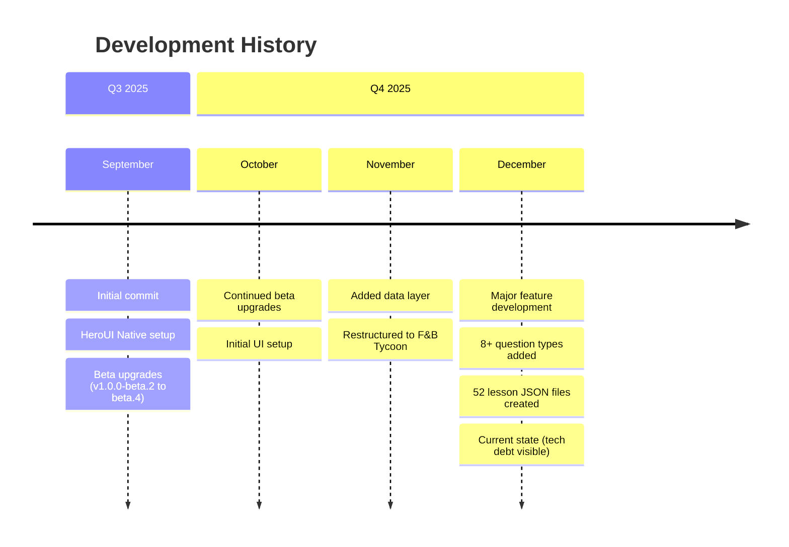
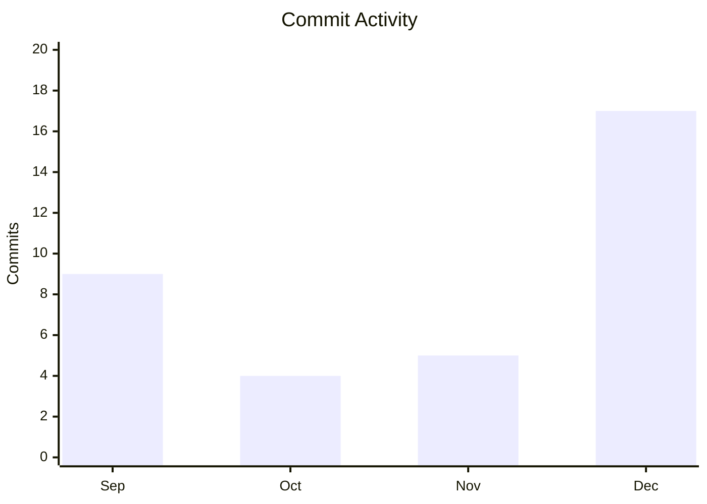
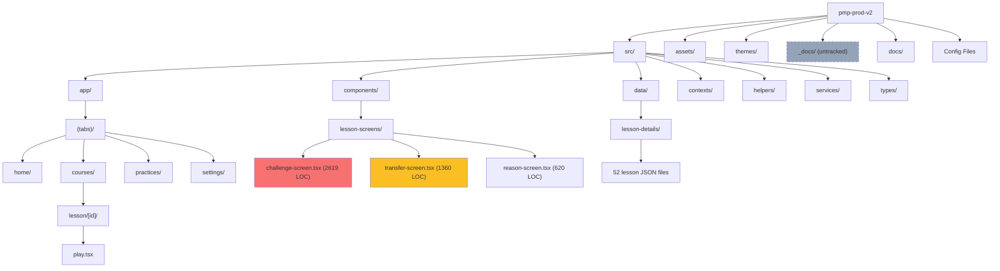
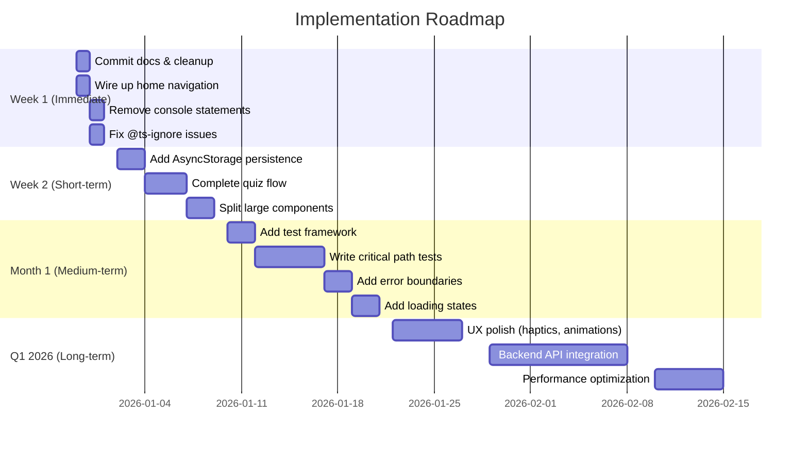
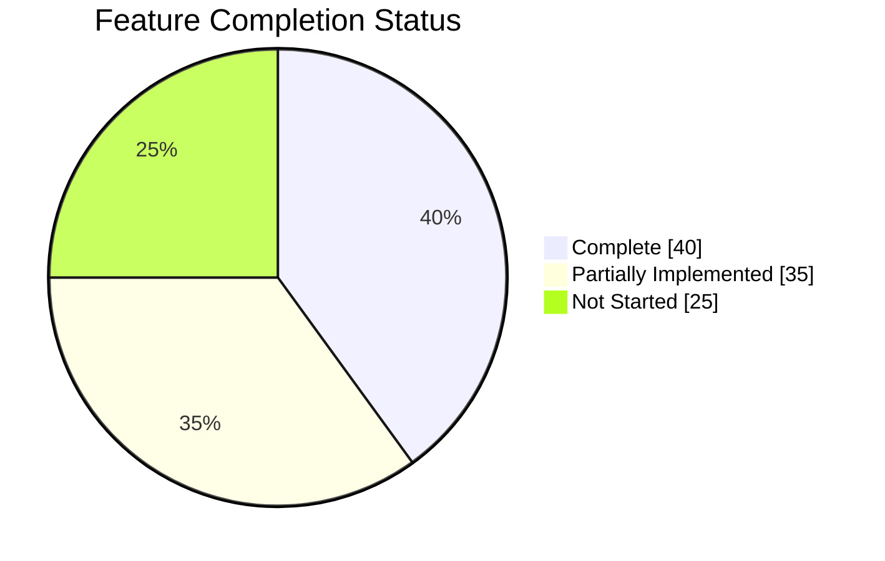
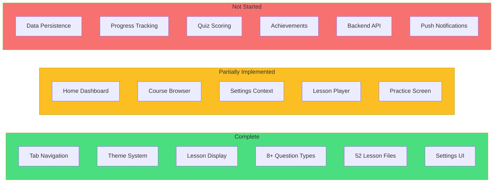
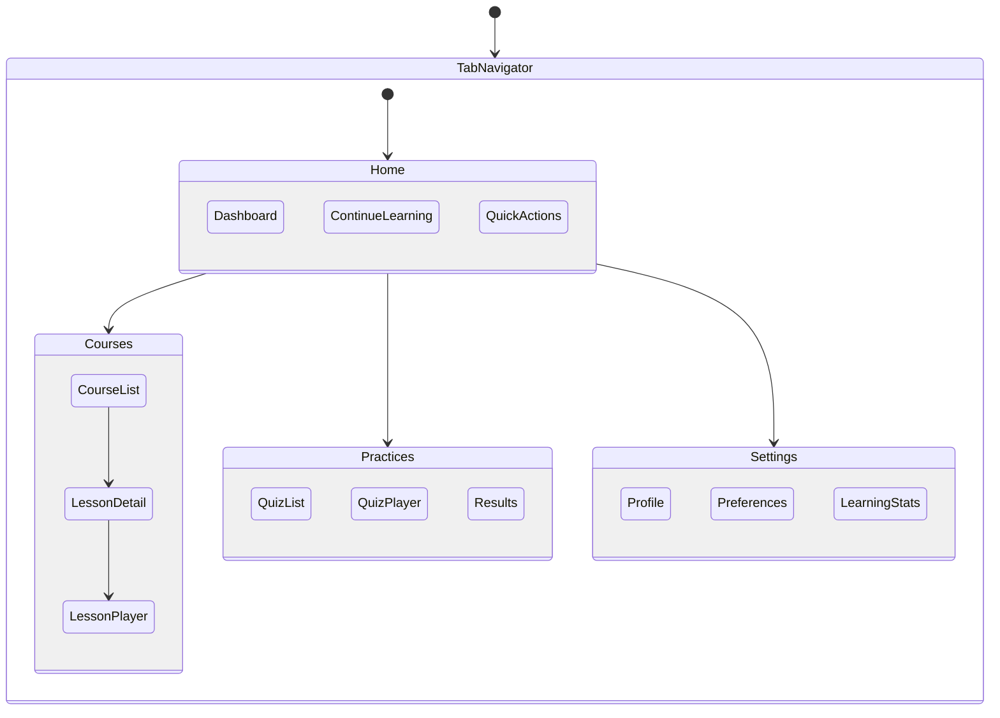

# Project Retrospective: F&B Tycoon (pmp-prod-v2)

**Generated:** 2025-12-29
**Analyzed by:** Claude Code
**Project Path:** /Users/hoangnamhai/Documents/workspace/pmp-prod-v2

---

## Executive Summary

| Metric | Value |
|--------|-------|
| **Project Age** | 3.5 months (first commit: 2025-09-16) |
| **Total Commits** | 35 |
| **Contributors** | 2 (Volodymyr Serbulenko: 24, Hải Hoàng Nam: 11) |
| **Total Source Files** | 201 (excluding node_modules) |
| **Lines of Code** | ~14,300 (TypeScript/TSX) |
| **Health Score** | **6/10** |

The project has a solid foundation with excellent component architecture and theming, but shows significant accumulated technical debt. The app's core lesson display is functional, but many interactive features remain unimplemented. The development pace has accelerated in December 2025 (17 commits) compared to earlier months.

### File Distribution



### Project Timeline



### Commits by Month



### Architecture Overview



---

## What Went Well

### 1. Clear Component Architecture
**Evidence:** `src/components/` with well-organized subdirectories:
- `lesson-screens/` - Screen-type components
- `settings/` - Settings-specific components
- `toast/` - Toast notification components
- Individual utility components (app-text, logo, theme-toggle)

**Why it works:** Separation of concerns makes components easy to find and maintain. Each component has a single responsibility.

**Recommendation:** Continue this pattern. Consider extracting shared logic into custom hooks.

---

### 2. Comprehensive Theming System
**Evidence:** `themes/` directory with 5 complete theme files:
- `fnb-tycoon.css` (primary app theme)
- `alpha.css`, `lavander.css`, `mint.css`, `sky.css` (alternatives)

**Why it works:** CSS-based theming with oklch colors provides excellent color consistency and dark mode support. Theme switching is fully functional via `app-theme-context.tsx`.

**Recommendation:** Document the theme color tokens for future reference.

---

### 3. Excellent Development Documentation
**Evidence:**
- `CLAUDE.md` - Detailed AI assistant instructions
- `README.md` - Clear project overview
- `_docs/unfinished-features.md` - Comprehensive gap analysis

**Why it works:** Makes onboarding and AI-assisted development efficient. Unfinished features are well-documented with file locations and priorities.

**Recommendation:** Commit the `_docs/` folder or merge key content into committed docs.

---

### 4. Substantial Content Library
**Evidence:** `src/data/lesson-details/` contains 52 lesson JSON files with structured content:
- Multiple question types (swipe classifier, matching, fill-in-blank, etc.)
- F&B restaurant scenario narratives
- Proper lesson structure (screens, questions, answers)

**Why it works:** Content-first approach allows rapid iteration on the learning experience.

**Recommendation:** Add JSON schema validation to ensure content consistency.

---

### 5. Consistent Use of Modern Stack
**Evidence:** `package.json` dependencies:
- Expo 54 (latest)
- React Native 0.81.5
- HeroUI Native (beta.9)
- expo-router for navigation
- zustand for state management
- react-native-reanimated for animations

**Why it works:** Modern, well-supported libraries with good documentation and community support.

**Recommendation:** Plan for HeroUI Native stable release migration when available.

---

## What Needs Improvement

### 1. Large Monolithic Files
**Evidence:** Several files exceed recommended size:

| File | Lines | Issue |
|------|-------|-------|
| `challenge-screen.tsx` | 2,619 | Contains 12+ question type components |
| `transfer-screen.tsx` | 1,360 | Multiple complex transfer interactions |
| `reason-screen.tsx` | 620 | Growing with new content types |

**Impact:** Difficult to maintain, test, and navigate. High cognitive load for developers.

**Recommendation:** Extract each question type into its own component:
```
src/components/lesson-screens/
├── challenge-screen/
│   ├── index.tsx
│   ├── swipe-classifier.tsx
│   ├── matching-question.tsx
│   ├── fill-blank-question.tsx
│   └── ...
```

---

### 2. No Test Coverage
**Evidence:** No `*.test.*`, `*.spec.*`, or `__tests__` directories found in the codebase.

**Impact:**
- Regressions go undetected
- Refactoring is risky
- No documentation of expected behavior

**Recommendation:**
1. Add Jest and React Native Testing Library
2. Start with critical path tests (lesson flow, quiz completion)
3. Add component tests for question types

---

### 3. Unfinished Features Blocking Launch
**Evidence:** From `_docs/unfinished-features.md`:
- Home screen quick actions not wired up
- Continue learning card has no navigation
- Practice quiz flow incomplete
- No data persistence (all progress is lost on app restart)
- Settings sheets partially implemented

**Impact:** App is not usable as a learning tool in current state.

**Recommendation:** Prioritize the implementation roadmap in this document's "Recommended Actions" section.

---

### 4. Uncommitted Documentation
**Evidence:** `git status` shows 13 uncommitted items including:
```
?? _docs/app-ui-v2-penpot.md
?? _docs/app-ui-v2.md
?? _docs/unfinished-features-plan.md
?? _docs/unfinished-features.md
```

**Impact:**
- Documentation could be lost
- Other contributors don't have access
- No version history for planning documents

**Recommendation:** Commit `_docs/` immediately or create a `.gitignore` entry with explicit exclusion reasoning.

---

### 5. Console Statements and Type Safety Issues
**Evidence:**
- 8 `console.log/error/warn` statements in production code
- 2 `@ts-ignore` comments suppressing type errors
- 141 matches for `any` type usage

**Impact:**
- Console statements affect performance
- Type issues can hide bugs
- `any` defeats TypeScript's benefits

**Recommendation:**
1. Remove or replace console statements with a proper logging service
2. Fix the underlying type issues instead of ignoring them
3. Gradually eliminate `any` types, starting with function parameters

---

## Technical Debt Inventory

```mermaid
quadrantChart
    title Technical Debt Priority Matrix
    x-axis Low Effort --> High Effort
    y-axis Low Priority --> High Priority
    quadrant-1 Do First
    quadrant-2 Plan & Schedule
    quadrant-3 Quick Wins
    quadrant-4 Consider Later

    Commit _docs folder: [0.1, 0.6]
    Remove console.log: [0.15, 0.3]
    Wire up home navigation: [0.25, 0.85]
    Add data persistence: [0.65, 0.9]
    Split challenge-screen.tsx: [0.7, 0.7]
    Add test suite: [0.8, 0.6]
    Fix @ts-ignore: [0.2, 0.4]
    Implement quiz flow: [0.75, 0.88]
    Add error boundaries: [0.4, 0.5]
    Add haptic feedback: [0.3, 0.35]
```

| Item | Location | Priority | Effort |
|------|----------|----------|--------|
| Wire up home screen navigation | `src/app/(tabs)/home/index.tsx:156-177` | Critical | 2 hours |
| Implement data persistence | `src/contexts/settings-context.tsx` | Critical | 1-2 days |
| Complete practice quiz flow | `src/app/(tabs)/practices/` | Critical | 2-3 days |
| Split challenge-screen.tsx | `src/components/lesson-screens/` | High | 1 day |
| Commit _docs folder | Project root | High | 10 min |
| Add AsyncStorage for progress | New service file | High | 4 hours |
| Remove console statements | Various (8 occurrences) | Medium | 30 min |
| Fix @ts-ignore comments | `src/components/toast/` | Medium | 1 hour |
| Add error boundaries | `src/app/_layout.tsx` | Medium | 2 hours |
| Add haptic feedback | Various touch handlers | Low | 2 hours |
| Add loading states | Screen components | Low | 3 hours |
| Set up test framework | Project root | Medium | 4 hours |

---

## Recommended Actions

### Implementation Roadmap



### 1. Immediate (This Week)

| Action | Why | How |
|--------|-----|-----|
| Commit _docs folder | Preserve planning work | `git add _docs/ && git commit` |
| Wire up home navigation | Unblocks primary user flow | Add `onPress` handlers to Quick Actions |
| Remove console statements | Prepare for production | Replace with conditional logging |
| Fix @ts-ignore comments | Improve type safety | Properly type the toast components |

### 2. Short-term (Next 2 Weeks)

| Action | Why | How |
|--------|-----|-----|
| Add AsyncStorage persistence | User progress survives restarts | Create `src/services/storage.ts` |
| Complete quiz flow | Core feature completion | Wire up practice screens to lesson data |
| Split challenge-screen.tsx | Maintainability | Extract each question type to own file |
| Connect settings to storage | User preferences persist | Extend settings-context with AsyncStorage |

### 3. Long-term (Next Quarter)

| Action | Why | How |
|--------|-----|-----|
| Add test framework | Prevent regressions | Set up Jest + Testing Library |
| Backend integration | Enable cloud sync, analytics | Design API, implement service layer |
| Performance audit | Smooth user experience | Profile render times, optimize lists |

---

## Feature Implementation Status



### Detailed Feature Status



---

## Metrics to Track

| Metric | Current | Target | How to Measure |
|--------|---------|--------|----------------|
| Test Coverage | 0% | 60% | Jest coverage report |
| TypeScript `any` usage | 141 | <20 | `grep -r "any" --include="*.ts*"` |
| Largest file size | 2,619 LOC | <500 LOC | `wc -l` on .tsx files |
| Console statements | 8 | 0 | `grep -r "console\."` |
| Uncommitted changes | 13 | 0 | `git status --porcelain | wc -l` |
| @ts-ignore usage | 2 | 0 | `grep -r "@ts-ignore"` |
| Features complete | 40% | 90% | Manual feature checklist |

---

## Health Checklist

### Code Quality
- [ ] All console.log statements removed or wrapped in dev-only conditionals
- [ ] No @ts-ignore or @ts-expect-error comments
- [ ] No files over 500 lines of code
- [ ] TypeScript strict mode enabled
- [ ] ESLint passing with no warnings

### Testing
- [ ] Test framework configured (Jest + Testing Library)
- [ ] Critical path tests written (lesson flow, quiz completion)
- [ ] Component tests for all question types
- [ ] CI/CD pipeline running tests on PR

### Documentation
- [ ] All documentation committed to git
- [ ] README reflects current project state
- [ ] API documentation for shared components
- [ ] Architecture decision records (ADRs) for major choices

### Architecture
- [ ] All features wired up and navigable
- [ ] Data persistence implemented
- [ ] Error boundaries in place
- [ ] Loading states for async operations
- [ ] Proper error handling UI

### Security
- [x] No secrets in source code
- [x] .gitignore covers sensitive files
- [ ] Environment variables for API URLs
- [ ] Input validation on all user inputs

### Production Readiness
- [ ] Performance profiling completed
- [ ] Memory leak audit done
- [ ] Accessibility audit completed
- [ ] App Store/Play Store assets prepared
- [ ] Privacy policy and terms of service

---

## Raw Metrics

### File Count by Type
```
  85 .tsx (React components)
  59 .json (data files)
  16 .ts (TypeScript)
  13 .png (images)
  12 .md (documentation)
   6 .css (themes)
   4 .js (config)
   1 .yaml, .ttf, .jpg, .jpeg, .gitignore
```

### Directory Sizes
```
448M  node_modules/ (excluded from analysis)
1.8M  src/
1.7M  assets/
464K  _docs/
 24K  themes/
 16K  docs/
8.0K  scripts/
```

### Largest Source Files
```
2,619 LOC  src/components/lesson-screens/challenge-screen.tsx
1,360 LOC  src/components/lesson-screens/transfer-screen.tsx
  620 LOC  src/components/lesson-screens/reason-screen.tsx
  332 LOC  src/components/accordion/accordion-with-depth-effect.tsx
  327 LOC  src/app/(tabs)/courses/lesson/[id].tsx
  322 LOC  src/app/(tabs)/courses/index.tsx
  309 LOC  src/app/(tabs)/courses/lesson/[id]/play.tsx
```

### Git Statistics
```
First commit: 2025-09-16
Last commit: 2025-12-24
Total commits: 35

Commits by month:
   9 commits - September 2025
   4 commits - October 2025
   5 commits - November 2025
  17 commits - December 2025

Contributors:
  24 commits - volodymyr_serbulenko
  11 commits - Hải Hoàng Nam
```

### Code Quality Indicators
```
Console statements: 8
@ts-ignore comments: 2
`any` type usage: 141 occurrences
TODO/FIXME comments: 0 (none found in code)
Test files: 0
```

### Uncommitted Changes
```
Modified:
  - src/app/(tabs)/_layout.tsx
  - src/components/lesson-screens/reason-screen.tsx
  - src/data/lesson-details/C1L1.json

Untracked:
  - _docs/app-ui-v2-penpot.md
  - _docs/app-ui-v2.md
  - _docs/art-styles-v3.md
  - _docs/penpot-notes.md
  - _docs/penpot-prompt.md
  - _docs/screens-design-plan.md
  - _docs/tokens.json
  - _docs/unfinished-features-plan.md
  - _docs/unfinished-features.md
  - docs/
```

---

## Appendix: Navigation Structure



---

*Generated by Claude Code on 2025-12-29*
